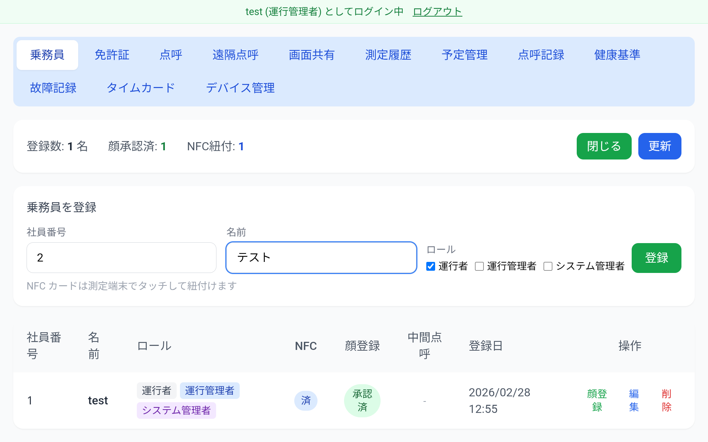
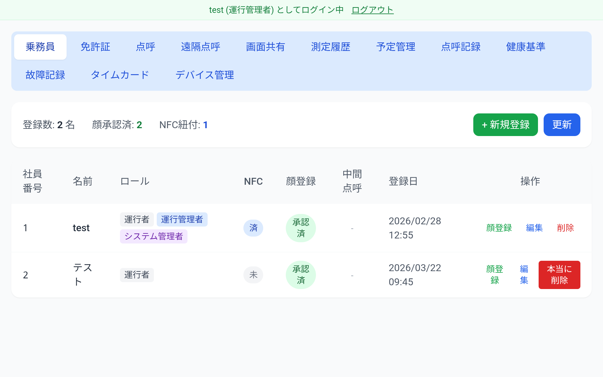
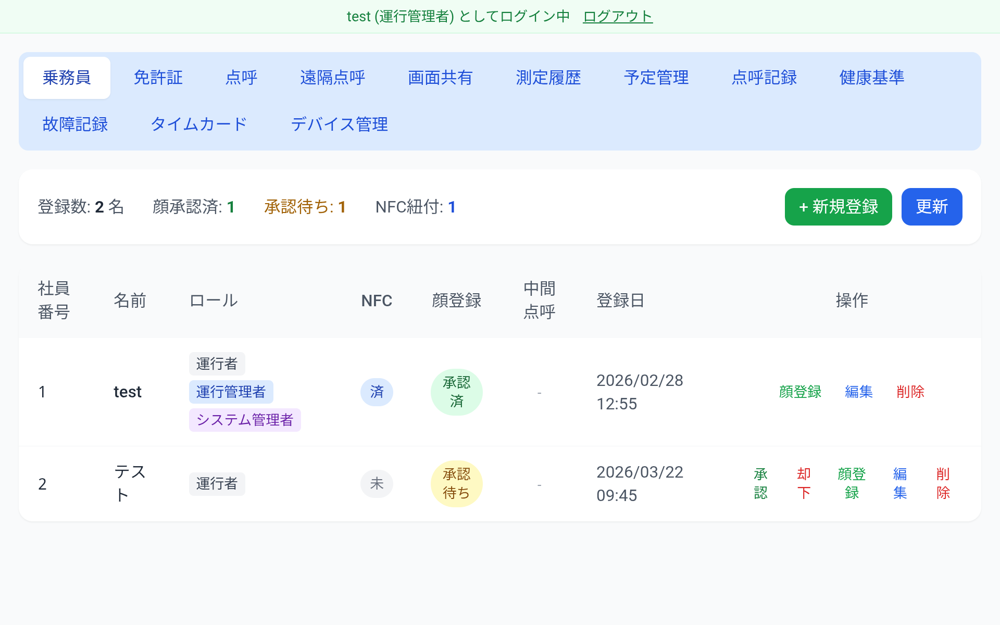
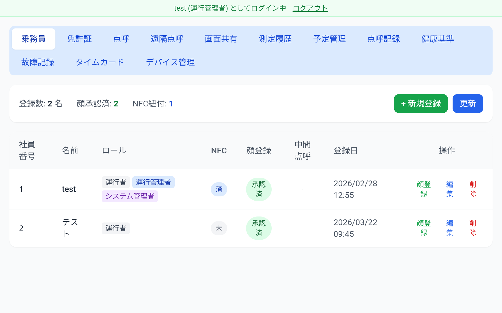

# 乗務員管理

## 概要

乗務員の登録・編集・削除、顔認証の承認状況の管理を行います。

## 乗務員一覧

ダッシュボードの「乗務員」タブで乗務員の一覧を確認できます。

| 列 | 内容 |
|----|------|
| 社員番号 | 乗務員の社員番号 |
| 名前 | 乗務員名 |
| ロール | 運行者 / 運行管理者 / システム管理者 |
| NFC | NFC カードの紐づけ状態 |
| 顔登録 | 顔認証の登録・承認状態 |
| 中間点呼 | 中間点呼の電話番号登録状態 |
| 登録日 | 登録日時 |
| 操作 | 顔登録・編集・削除ボタン |

## 乗務員の登録

「+新規登録」ボタンをタップすると登録フォームが表示されます。

1. 社員番号・名前を入力します
2. ロール（運行者 / 運行管理者 / システム管理者）を選択します
3. 「登録」をタップします

## 乗務員の編集

一覧の「編集」ボタンから名前・ロールを変更できます。

## 乗務員の削除

一覧の「削除」ボタンをタップすると確認が表示されます。

「本当に削除」をタップすると乗務員が削除されます。

## 顔認証の登録状況

| ステータス | 内容 |
|-----------|------|
| 未登録 | 乗務員がまだ顔を登録していない |
| 承認待ち | 顔が登録され、管理者の承認を待っている |
| 承認済 | 管理者が顔登録を承認した |

承認待ちの乗務員には「承認」「却下」ボタンが表示されます。「承認」をタップすると、その乗務員の顔認証が有効になります。

## 中間点呼の登録状況

「中間点呼」列に電話番号が表示されている場合、中間点呼に登録済みです。
