# 運行管理者ガイド

運行管理者向けの操作マニュアルです。

---

## 初期設定

### ログイン

Google アカウントでログインします。ログイン後、ダッシュボードが表示されます。画面上部のロール切替で「運行管理者」を選択してください。

### 乗務員の登録

乗務員タブから乗務員を登録します。詳しくは本ページの「乗務員管理」を参照してください。

### デバイスの登録

デバイス管理タブから端末を登録します。詳しくは本ページの「デバイス管理」を参照してください。

---

## ダッシュボード

### 乗務員

乗務員の登録・編集・削除、顔認証の承認を管理します。

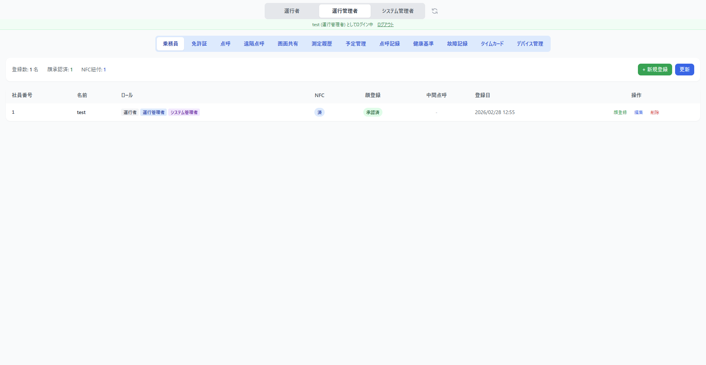

### 免許証

乗務員の運転免許証情報を管理します。NFC カードで免許証を読み取り、有効期限を管理できます。

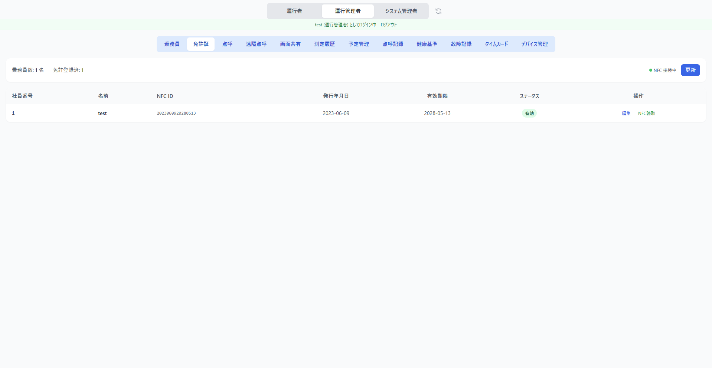

### 点呼

点呼の実施状況を管理します。

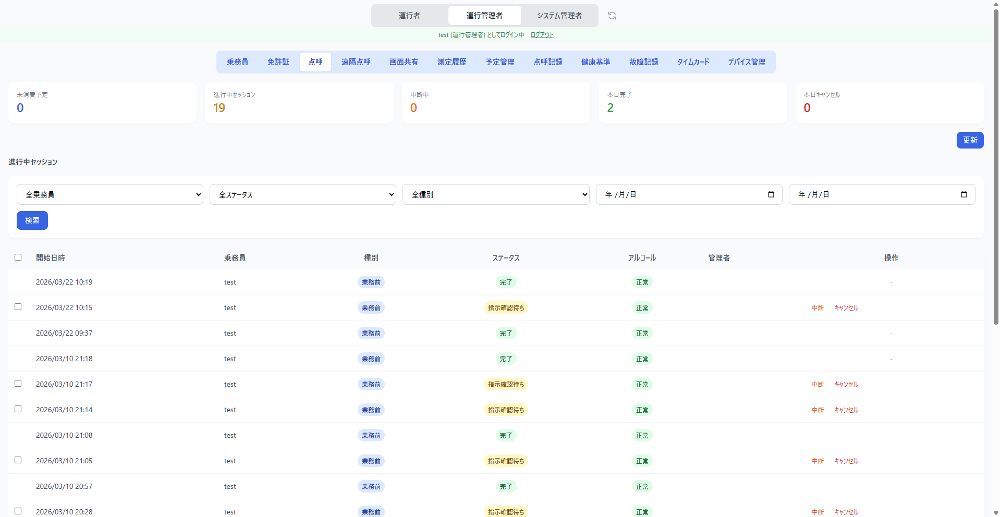

### 遠隔点呼

遠隔点呼モニターです。接続待ちデバイスを確認し、ビデオ通話を開始できます。詳しくは [遠隔点呼の実施](remote-tenko.md) を参照してください。

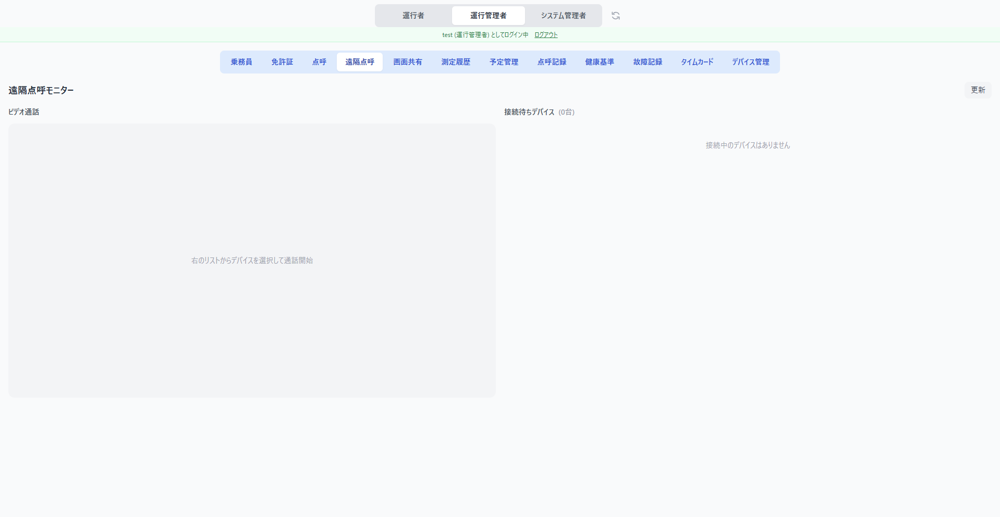

### 画面共有

端末の画面をリアルタイムで共有・確認できます。

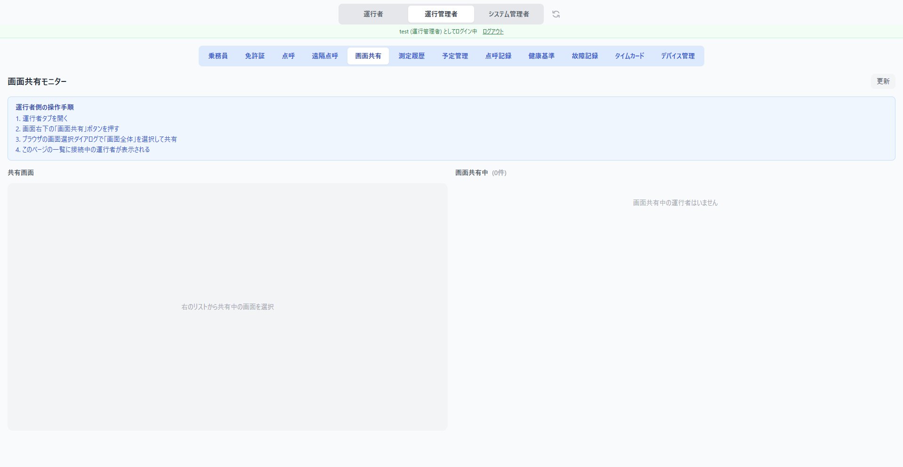

### 測定履歴

アルコール測定・バイタル測定の履歴を確認できます。

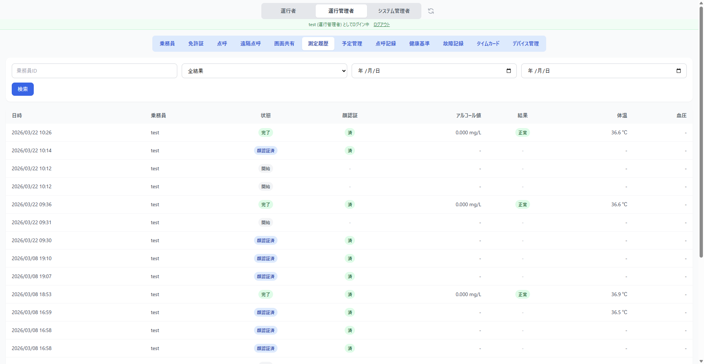

### 予定管理

点呼スケジュールの作成・編集・削除を行います。

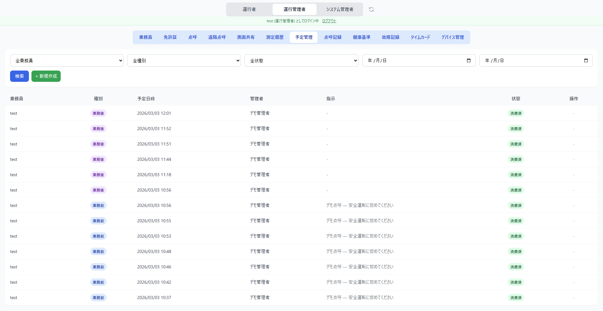

### 点呼記録

点呼の実施記録を検索・閲覧・CSV エクスポートできます。

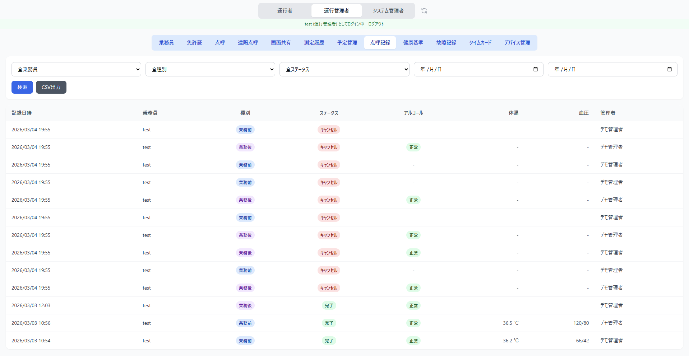

### 健康基準

乗務員の健康基準値（体温・血圧・脈拍）の閾値と許容範囲を設定します。安全運転判定に使用されます。

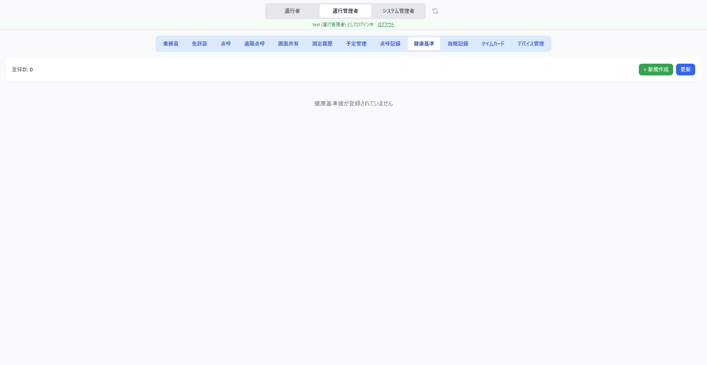

### 故障記録

測定機器の故障を記録・管理します。

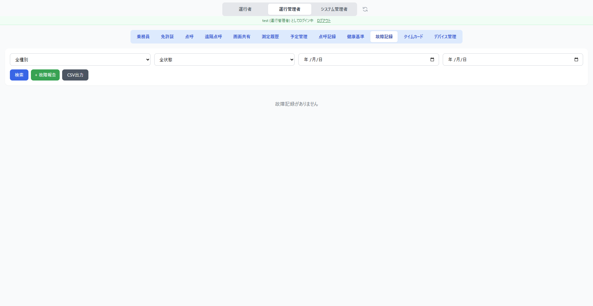

### タイムカード

NFC カードと乗務員の紐付け、打刻履歴の確認を行います。

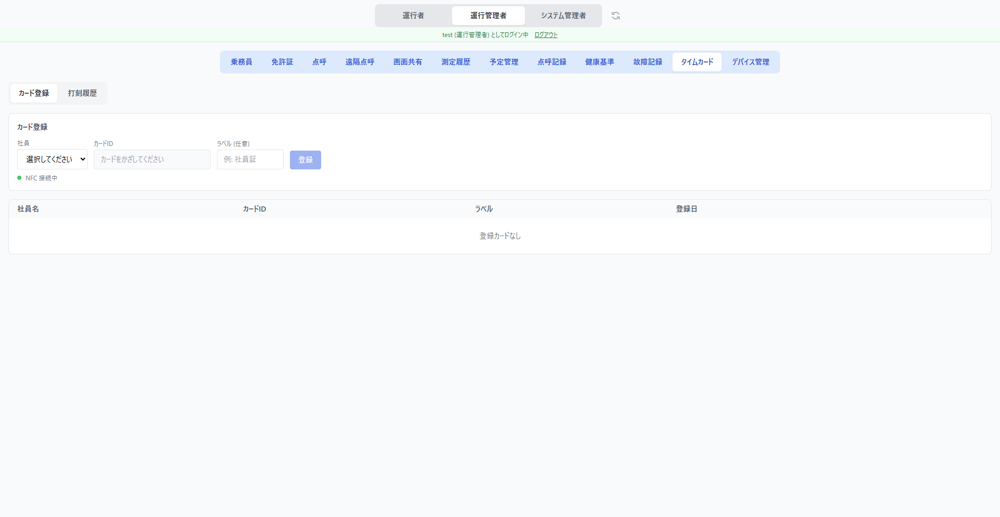

### デバイス管理

端末の登録・承認・無効化を管理します。

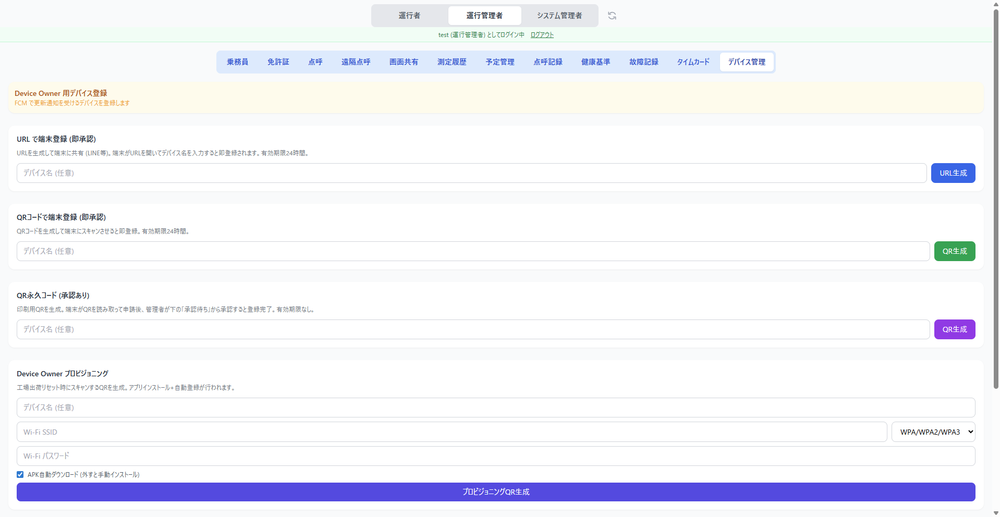

---

## 乗務員管理

### 乗務員一覧

| 列 | 内容 |
|----|------|
| 社員番号 | 乗務員の社員番号 |
| 名前 | 乗務員名 |
| ロール | 運行者 / 運行管理者 / システム管理者 |
| NFC | NFC カードの紐づけ状態 |
| 顔登録 | 顔認証の登録・承認状態 |
| 中間点呼 | 中間点呼の電話番号登録状態 |
| 登録日 | 登録日時 |
| 操作 | 顔登録・編集・削除ボタン |

### 乗務員の登録

「+新規登録」ボタンをタップすると登録フォームが表示されます。

1. 社員番号・名前を入力します
2. ロール（運行者 / 運行管理者 / システム管理者）を選択します
3. 「登録」をタップします

### 乗務員の編集

一覧の「編集」ボタンから名前・ロールを変更できます。

### 乗務員の削除

一覧の「削除」ボタンをタップすると確認が表示されます。

「本当に削除」をタップすると乗務員が削除されます。

### 顔認証の登録状況

| ステータス | 内容 |
|-----------|------|
| 未登録 | 乗務員がまだ顔を登録していない |
| 承認待ち | 顔が登録され、管理者の承認を待っている |
| 承認済 | 管理者が顔登録を承認した |

承認待ちの乗務員には「承認」「却下」ボタンが表示されます。「承認」をタップすると、その乗務員の顔認証が有効になります。

---

## デバイス管理

### 登録フロー

3種類の登録フローを提供します。

| フロー | 流れ | 承認 | 有効期限 |
|--------|------|------|---------|
| QR一時コード（推奨） | 管理者がQR生成 → 端末でスキャン → 即登録 | 不要 | 10分 |
| QR永久コード | 管理者がQR生成(PDF印刷可) → 端末でスキャン → 管理者が承認 | 必要 | なし |
| URL共有 | 管理者がURL生成 → LINE等で共有 → 端末で登録 | 不要 | 24時間 |

### デバイス一覧

登録済みデバイスの一覧が表示されます。ステータス（有効 / 無効）、デバイス名、電話番号、登録日を確認できます。

### 承認・却下

QR永久フローで登録されたデバイスは「承認待ち」状態になります。「承認」または「却下」をクリックして処理します。

### 着信設定

デバイスごとに遠隔点呼の着信 ON/OFF とスケジュールを設定できます。

### デバイスの無効化・削除

デバイスの「無効化」で一時的に利用を停止、「削除」で完全に削除できます。
