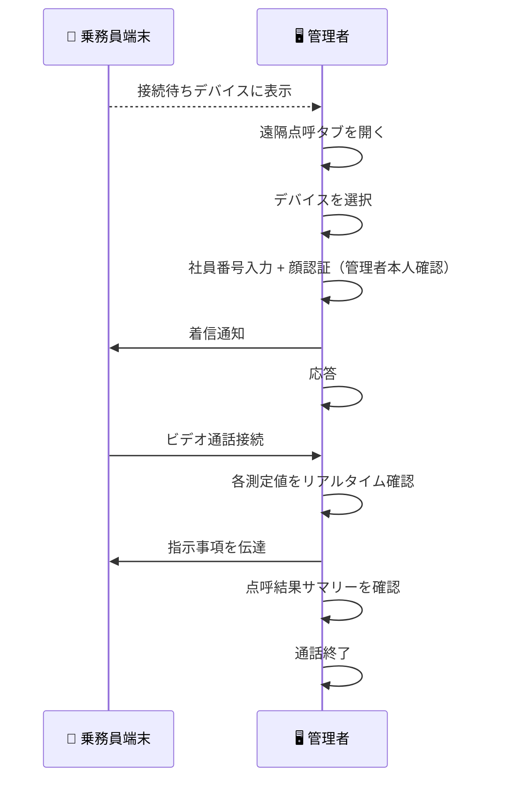
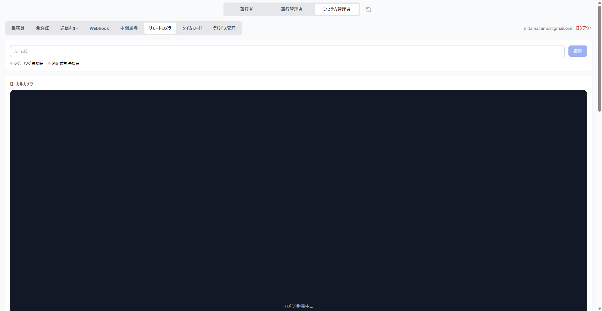

# 遠隔点呼の実施

## 概要

運行管理者が遠隔で点呼を実施する手順です。

## 全体の流れ

## Step 1: 接続待ちデバイスの確認

ダッシュボードの「リモートカメラ」タブを開きます。乗務員が端末で遠隔点呼タブを開くと、接続待ちデバイスの一覧に表示されます。

## Step 2: 通話開始

点呼を実施するデバイスの「通話開始」をクリックします。端末側に着信通知が届きます。

管理者が「応答」ボタンをクリックするとビデオ通話が接続されます。

## Step 3: 管理者の本人確認（顔認証）

通話開始前に、管理者自身の本人確認が求められます。

1. **社員番号の入力**: 管理者の社員番号を入力します（初回のみ。2回目以降はスキップされます）
2. **顔認証**: カメラで管理者自身の顔を撮影し、事前に登録済みの顔データと照合します（毎回実施）

認証に成功すると、ビデオ通話が開始されます。失敗した場合は「もう一度お試しください」と表示されます。

!!! info "事前準備"
    管理者の顔データは、AlcoholChecker アプリの顔登録機能で事前に登録しておく必要があります。登録済みの社員番号で、運行管理者または管理者ロールを持つユーザーのみ認証できます。

## Step 4: 点呼の確認

ビデオ通話で乗務員の映像を見ながら、各ステップの実施状況を確認します。

| ステップ | 管理者の確認内容 |
|---------|---------------|
| 顔認証 | 本人であることを映像で確認 |
| 体温・血圧 | 測定値が基準範囲内であること |
| 自己申告 | 疾病・疲労・睡眠不足の回答を確認 |
| 日常点検 | 8項目の点検結果を確認 |
| アルコール測定 | 0.00 mg/L であることを確認 |

## Step 5: 指示事項の伝達

指示事項を入力し、乗務員に伝達します。乗務員が「確認しました」をタップすると次に進みます。

## Step 5: 点呼完了

点呼結果のサマリーを確認し、「通話終了」をクリックして終了します。

!!! note "ネットワーク要件"
    遠隔点呼にはカメラ・マイクの権限と安定したネットワーク接続が必要です。通信が切れた場合は自動で再接続を試みます。
