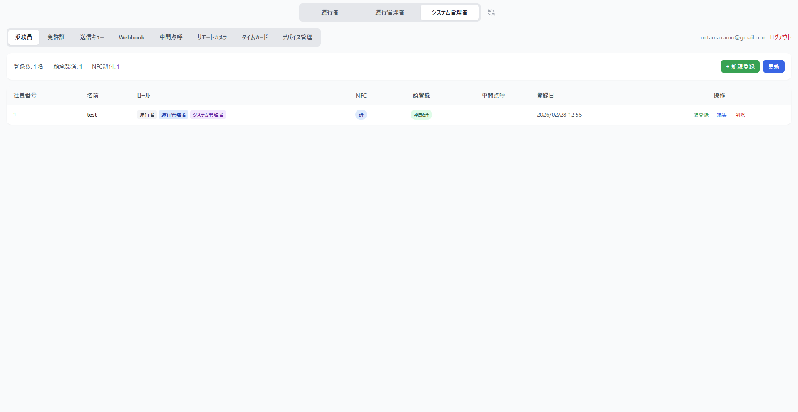
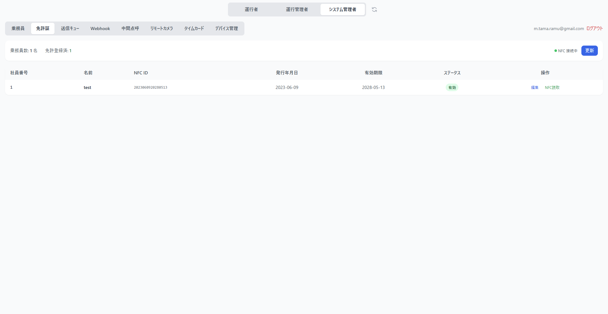
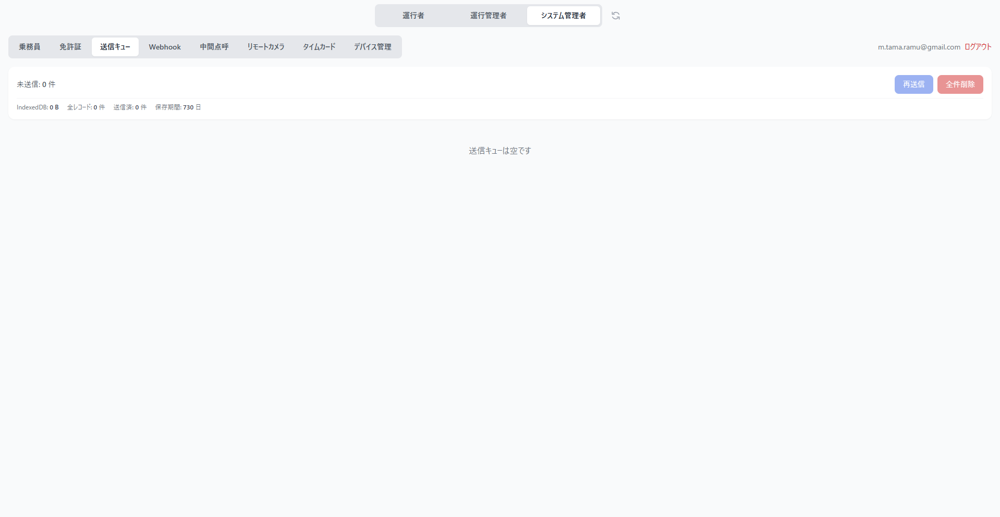
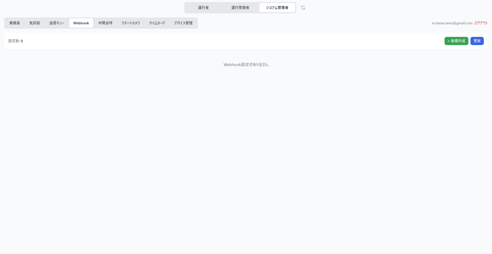
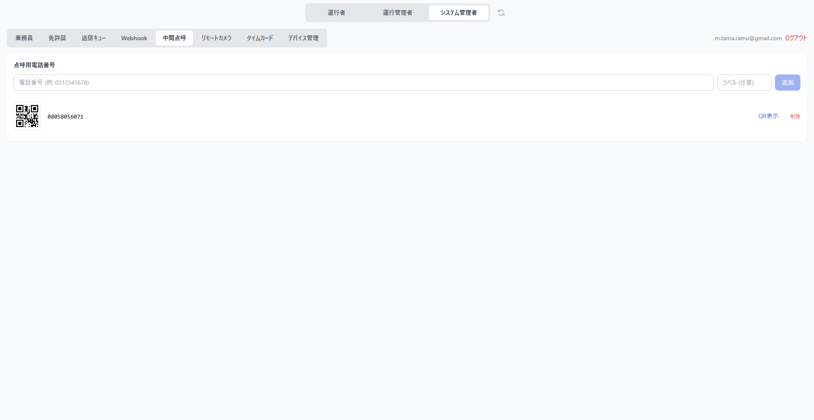
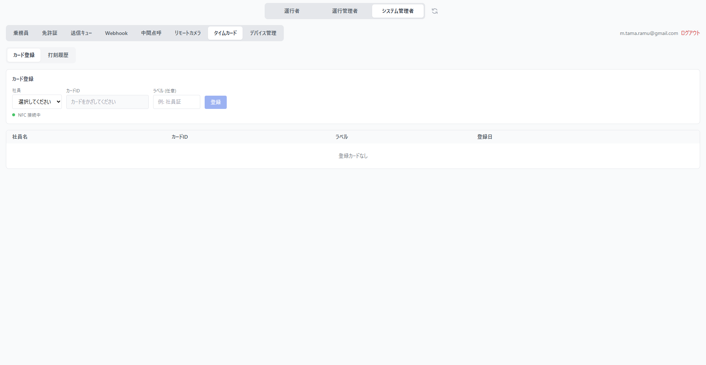
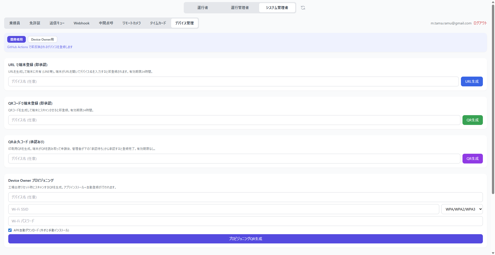

# システム管理者ガイド

システム管理者向けの操作マニュアルです。運行管理者のタブに加えて、システム設定用のタブが利用できます。

---

## ダッシュボード

画面上部のロール切替で「システム管理者」を選択してください。

### 乗務員

### 免許証

### 送信キュー

オフライン時に蓄積された測定データの送信キューを管理します。

### Webhook

点呼完了や測定結果などのイベントを外部システムに通知するための設定です。「+新規作成」ボタンから、通知先 URL とイベント種別を設定します。

### 中間点呼

中間点呼用の電話番号マスタと登録運転者を管理します。

### リモートカメラ

遠隔点呼のビデオ通話を管理します。

### タイムカード

### デバイス管理

