# 運行者ガイド

乗務員向けの操作マニュアルです。

---

## はじめに

### 概要

ALC アプリは、業務用アルコール検知・点呼管理システムです。乗務員の本人確認（顔認証）、アルコール測定、バイタル測定、日常点検などを一連の流れで実施できます。

### 端末のセットアップ

1. Android タブレットに ALC アプリをインストールします
2. アプリを起動し、ログインまたはデバイス登録を行います
3. メンテナンス画面で FC-1200（アルコールチェッカー）と BLE 医療機器の接続を確認します

### ログイン方法

**Google アカウントでログイン**

管理者から付与された Google アカウントでログインします。

**デバイス登録でログイン**

管理者が発行した QR コードまたは URL を使ってデバイスを登録します。詳しくは本ページ下部の「デバイス登録」を参照してください。

### 画面の見かた

アプリのメイン画面は、上部のタブで機能を切り替えます。

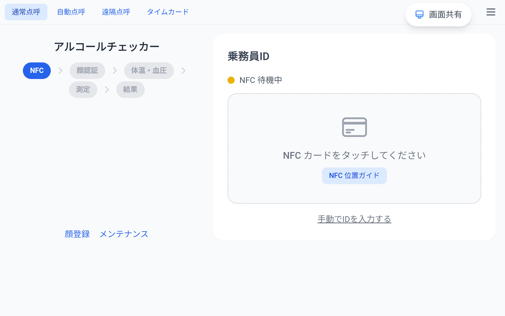

| タブ | 機能 |
|------|------|
| 通常点呼 | NFC カードで乗務員を識別し、アルコール測定・バイタル測定を実施 |
| 自動点呼 | スケジュールに基づく点呼フロー（顔認証→測定→自己申告→日常点検→指示確認） |
| 遠隔点呼 | 運行管理者とビデオ通話しながら点呼を実施 |
| タイムカード | NFC カードで出退勤の打刻 |

画面左側にはフローのステップが表示され、現在のステップがハイライトされます。画面下部の「顔登録」「メンテナンス」リンクから、それぞれの設定画面に移動できます。

### メンテナンス画面

メンテナンス画面では、測定機器の接続状態を確認できます。

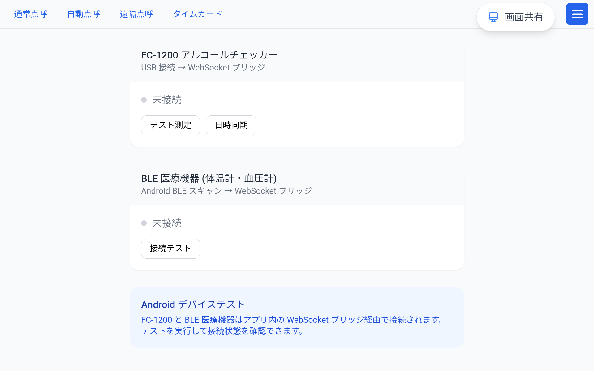

- **FC-1200 アルコールチェッカー**: USB 接続 → WebSocket ブリッジで通信
- **BLE 医療機器（体温計・血圧計）**: Bluetooth 接続 → WebSocket ブリッジで通信

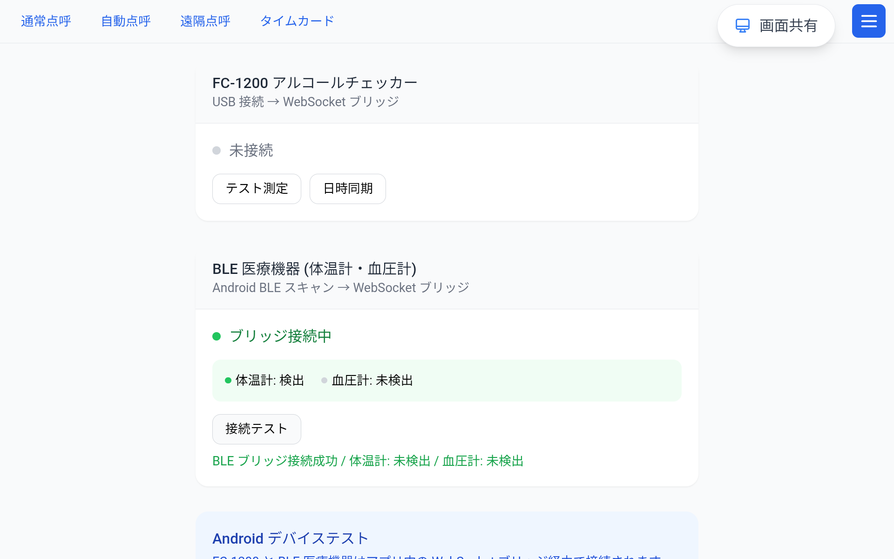

BLE ブリッジが接続されると、検出された機器が表示されます。

---

## 顔認証

### 概要

顔認証は、点呼時の本人確認に使用します。事前に顔を登録し、点呼実施時にカメラで本人であることを確認します。

### 顔の登録

**登録手順**

1. メイン画面下部の「顔登録」リンクをタップします
2. カメラが起動し、顔の検出が始まります
3. 画面の枠内に顔が収まるように位置を調整します
4. 検出条件（顔サイズ、正面向き、まばたき）がすべて緑色になったら、確認ダイアログが表示されます
5. 「登録する」をタップして登録を完了します

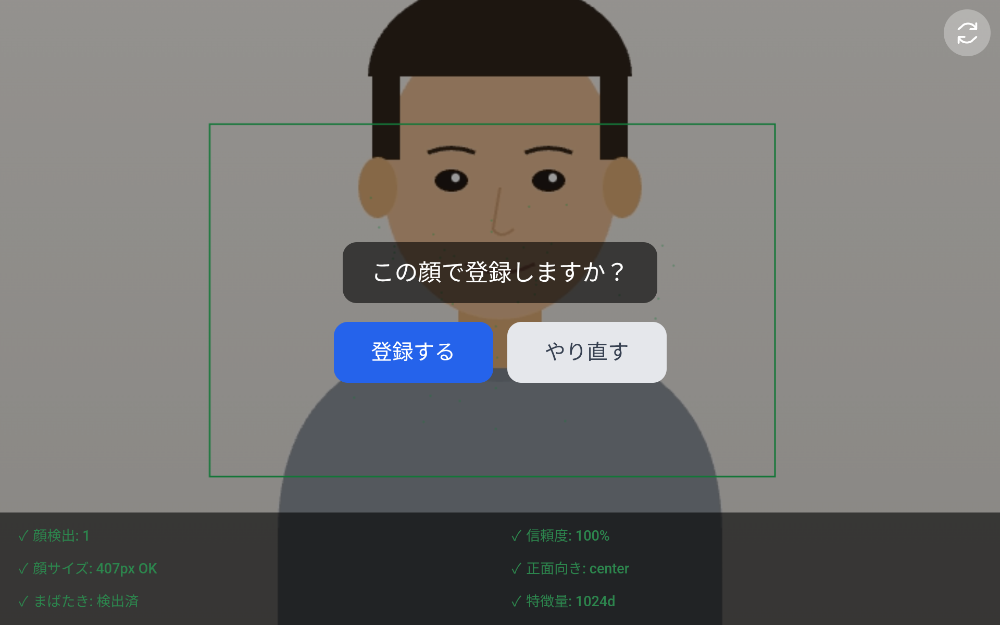

**撮影のコツ**

- 正面を向き、カメラから 30〜50cm の距離を保ちます
- 明るい場所で撮影してください（逆光を避ける）
- メガネ・マスクは外してください
- 画面下部のステータスを確認し、すべて緑色（OK）になるのを待ちます

### 顔認証の実施

点呼フロー中に自動で顔認証ステップに進みます。

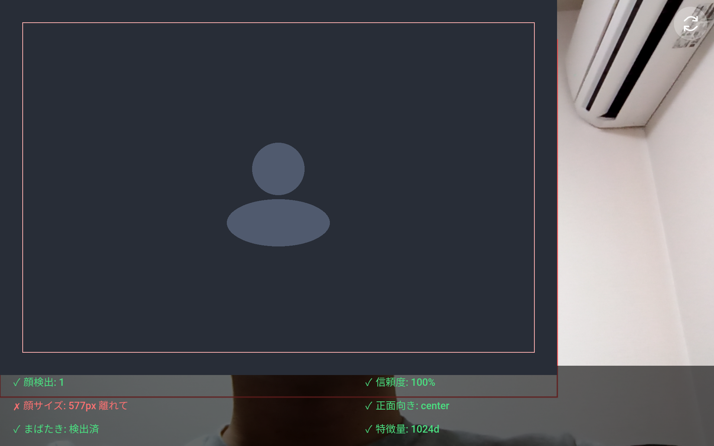

画面下部に検出ステータスが表示されます:

| 項目 | 内容 |
|------|------|
| 顔検出 | 顔が検出されたか（数値は検出数） |
| 顔サイズ | 顔が十分な大きさか |
| まばたき | まばたきが検出されたか（なりすまし防止） |
| 信頼度 | 認証の信頼度（100% で最高） |
| 正面向き | 正面を向いているか |
| 特徴量 | 特徴量が正常に抽出されたか |

すべての項目が緑色のチェックマークになると、自動的に認証が完了し次のステップに進みます。

### 認証に失敗する場合

- 照明が暗い場合は明るい場所に移動してください
- カメラに汚れがないか確認してください
- メガネ・マスクは外してください
- 登録時と大きく外見が変わった場合は再登録が必要です

### 再登録が必要な場合

管理者が乗務員の顔登録をリセットした場合や、モデルバージョンが更新された場合に再登録が求められます。メイン画面下部の「顔登録」から再度登録してください。

---

## アルコール測定

### 概要

FC-1200 アルコールチェッカーを使用して呼気中のアルコール濃度を測定します。

### 測定機器（FC-1200）の接続

FC-1200 は USB ケーブルで端末に接続し、WebSocket ブリッジ経由で通信します。接続状態はメンテナンス画面で確認できます。

### 測定手順

1. 点呼フロー中に「アルコール測定」ステップに進むと、自動で FC-1200 との接続を待ちます
2. 「息を吹きかけてください」と表示されたら、FC-1200 のセンサー部に向かって約5秒間息を吹きかけます

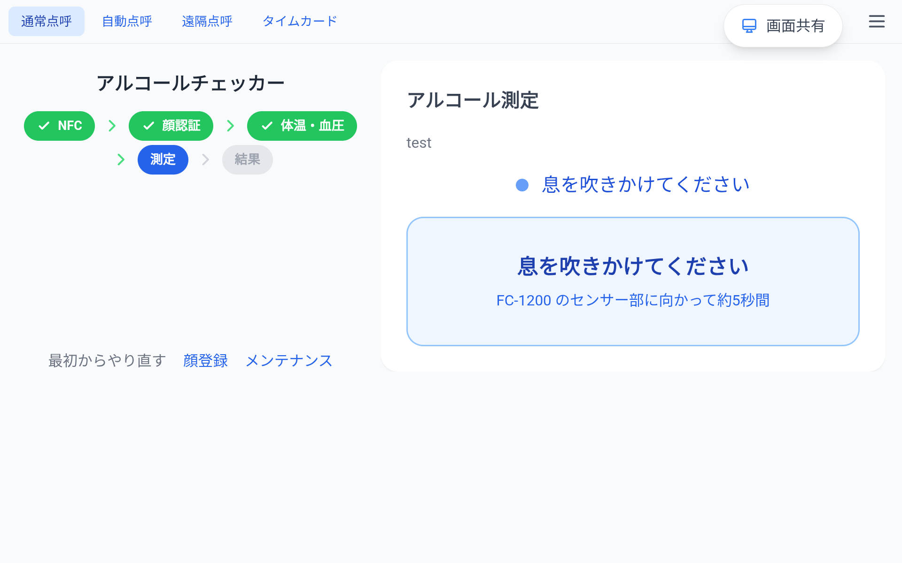

3. 測定が完了すると、結果が自動で記録され次のステップに進みます

### 測定結果の見かた

測定完了後、結果画面にアルコール濃度が表示されます。

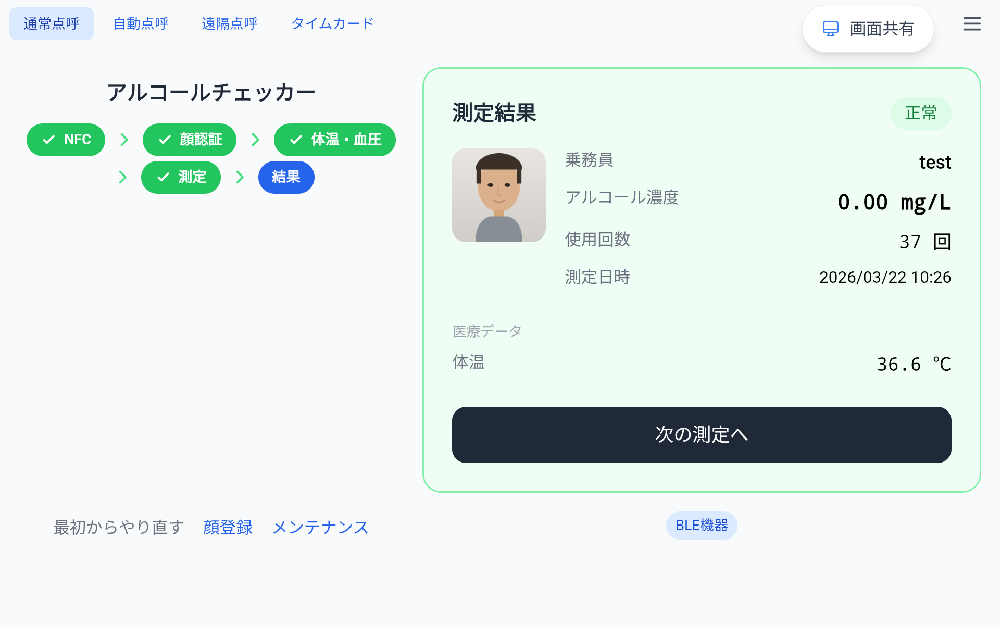

| 項目 | 内容 |
|------|------|
| 乗務員 | 測定対象の乗務員名 |
| アルコール濃度 | 測定値（mg/L） |
| 使用回数 | FC-1200 の累計使用回数 |
| 測定日時 | 測定を実施した日時 |
| 体温 | BLE 体温計で測定した体温 |

**0.00 mg/L** であれば「正常」と判定されます。

### 測定に失敗する場合

- FC-1200 が「未接続」の場合、メンテナンス画面で接続状態を確認してください
- 息を吹きかける時間が短すぎると測定できません（約5秒間）
- 測定直後に再測定する場合、センサーのリセットを待ってください

### よくある質問

**Q: 測定値が 0.00 以外だった場合は？**
A: 飲酒していない場合でも、口腔内のアルコール成分（マウスウォッシュ等）で反応することがあります。水で口をすすいでから 15 分以上待って再測定してください。

---

## 自動点呼

### 概要

自動点呼は、スケジュールに基づいて乗務前・乗務後の点呼を自動で実施する機能です。顔認証による本人確認から日常点検まで、一連のフローをガイドに従って進めます。

!!! info "開発中"
    自動点呼タブの画面は現在開発中です。

### 点呼の流れ

自動点呼は以下の9ステップで構成されます。

**1. スケジュール選択**

未消化の点呼スケジュールから実施するものを選択します。

**2. 本人確認（顔認証）**

カメラで顔認証を行い、本人であることを確認します。

**3. アルコール測定**

FC-1200 でアルコール濃度を測定します。

**4. バイタル測定**

BLE 医療機器または手動入力で体温・血圧を測定します。

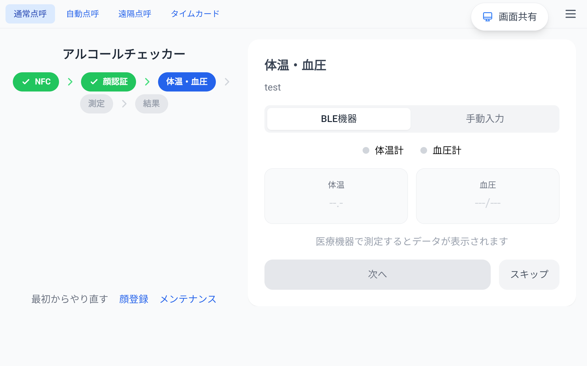

- **BLE機器タブ**: 体温計・血圧計が自動検出され、測定値が表示されます
- **手動入力タブ**: 機器が接続できない場合、手動で数値を入力できます

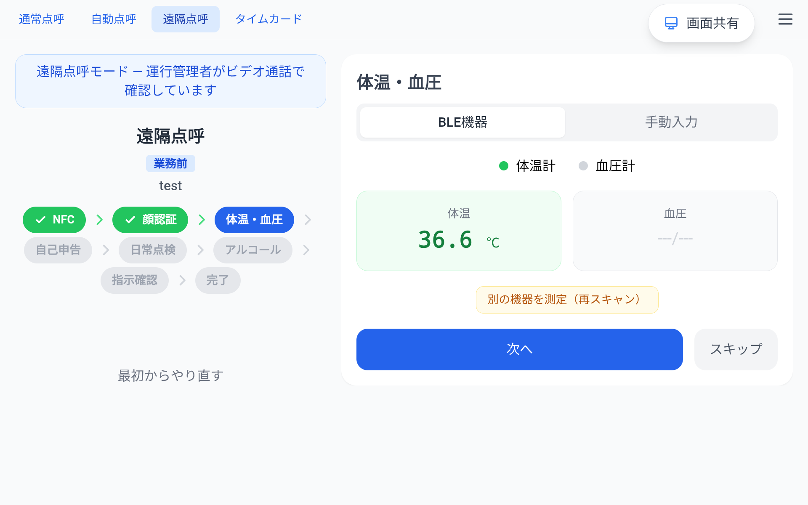

測定が完了したら「次へ」をタップします。「スキップ」で測定をスキップすることもできます。

**5. 自己申告**

健康状態の自己申告を行います。

**6. 安全運転判定**

バイタル測定の結果と自己申告の内容から、安全運転の可否が自動で判定されます。健康基準値を超過した場合や自己申告で「はい」と回答した場合、注意喚起が表示されます。

**7. 日常点検**

車両の日常点検を実施します。

**8. 指示事項確認**

運行管理者からの指示事項を確認し、「確認しました」をタップします。

**9. 完了**

すべてのステップが完了すると、点呼結果のサマリーが表示されます。

### 点呼が中断された場合

点呼の途中で「最初からやり直す」をタップするか、アプリを閉じた場合、点呼は中断状態になります。中断された点呼は、再度同じスケジュールを選択することで再開できます。

### よくある質問

**Q: スケジュールが表示されない場合は？**
A: 管理者がスケジュールを登録していない可能性があります。管理者に確認してください。

**Q: 途中でやり直したい場合は？**
A: 画面左下の「最初からやり直す」をタップすると、最初のステップに戻ります。

---

## 自己申告

### 概要

自己申告は、点呼フロー中に乗務員が自身の健康状態を申告するステップです。申告内容は安全運転判定に反映されます。

### 申告項目

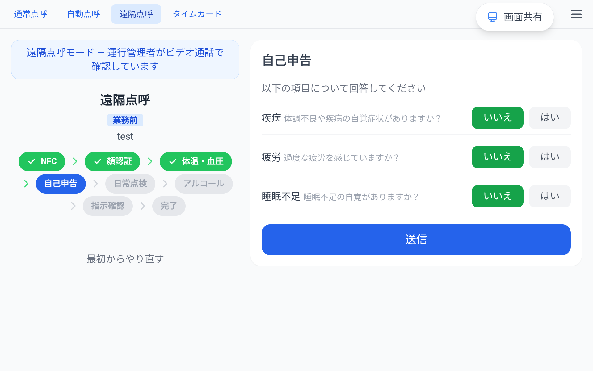

以下の3項目について「はい」または「いいえ」で回答します。

| 項目 | 質問 |
|------|------|
| 疾病 | 体調不良や疾病の自覚症状がありますか？ |
| 疲労 | 過度な疲労を感じていますか？ |
| 睡眠不足 | 睡眠不足の自覚がありますか？ |

### 申告手順

1. 各項目について「はい」または「いいえ」を選択します
2. すべての項目に回答したら「送信」をタップします
3. 自動的に次のステップに進みます

### 申告内容と安全運転判定

いずれかの項目で「はい」と回答した場合、安全運転判定で注意喚起が表示されます。運行管理者にも通知され、運行の可否について判断が行われます。

---

## 日常点検

### 概要

日常点検は、点呼フロー中に車両の安全状態を確認するステップです。8つの点検項目について OK/NG を記録します。

### 点検項目

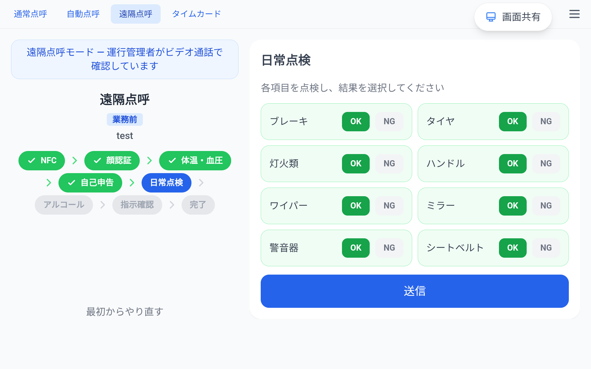

| 項目 | 確認内容 |
|------|----------|
| ブレーキ | ブレーキの効き具合 |
| タイヤ | タイヤの空気圧・摩耗・損傷 |
| 灯火類 | ヘッドライト・ウインカー・ブレーキランプ等 |
| ハンドル | ハンドルの操作感・遊び |
| ワイパー | ワイパーの動作・ゴムの状態 |
| ミラー | バックミラー・サイドミラーの状態 |
| 警音器 | クラクションの動作 |
| シートベルト | シートベルトの状態 |

### 点検の実施手順

1. 各項目について「OK」または「NG」をタップします
2. すべての項目を点検したら「送信」をタップします

### NG項目がある場合

NG 項目がある場合、点呼はキャンセルされます。車両の整備・修理を行い、問題が解消されてから再度点呼を実施してください。

---

## 遠隔点呼

### 概要

遠隔点呼は、運行管理者とビデオ通話をしながら点呼を実施する機能です。管理者がリアルタイムで映像を確認しながら、各ステップを進めます。

### 遠隔点呼の開始

「遠隔点呼」タブをタップすると、遠隔点呼モードに入ります。

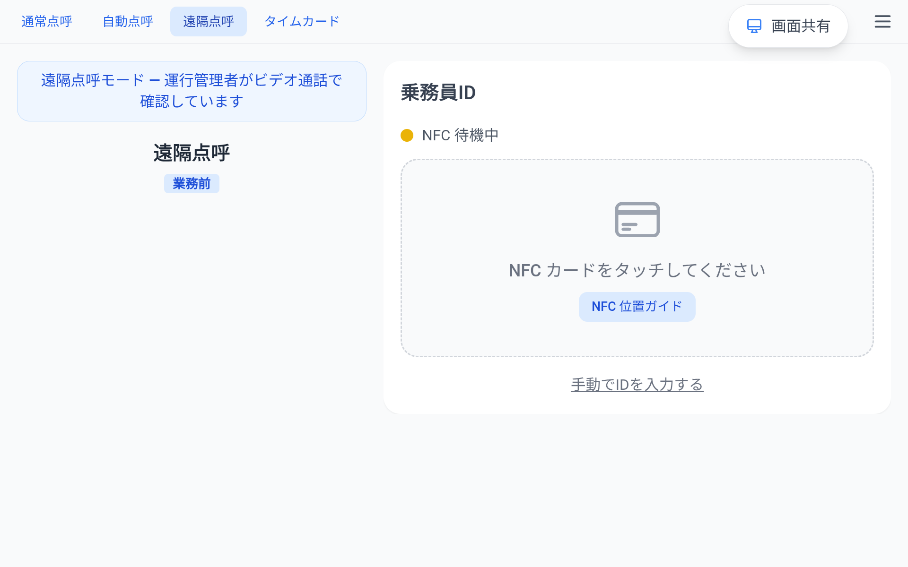

NFC カードまたは手動 ID 入力で乗務員を識別すると、管理者からの接続を待機します。

### 着信と応答

管理者が点呼を開始すると、着信画面が表示されます。

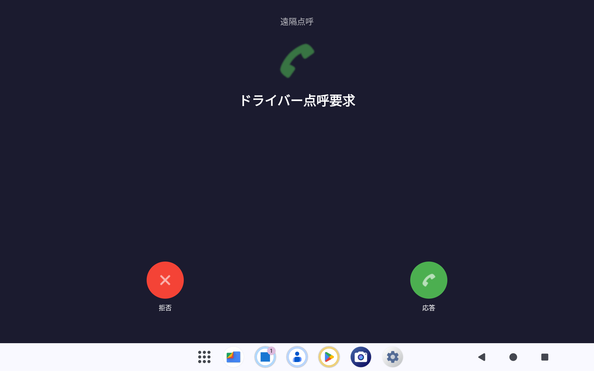

- **応答**: 緑のボタンをタップするとビデオ通話が開始されます
- **拒否**: 赤のボタンをタップすると着信を拒否します

### ビデオ通話中の操作

ビデオ通話が開始されると、画面左上にカメラ映像のプレビューが表示されます。管理者がリモートで各ステップを確認します。

### 点呼の流れ

遠隔点呼のフローは自動点呼と同じ9ステップです。各ステップの画面は通常の点呼と同様ですが、左上にビデオ通話のウィンドウが常時表示されます。

**バイタル測定**

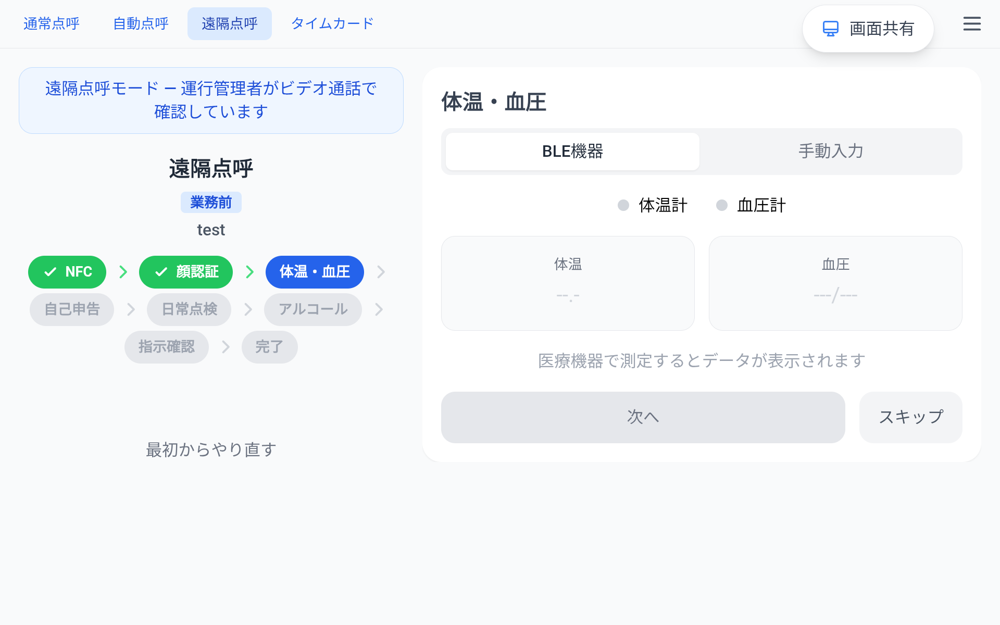

BLE 医療機器または手動入力で測定します。

**アルコール測定**

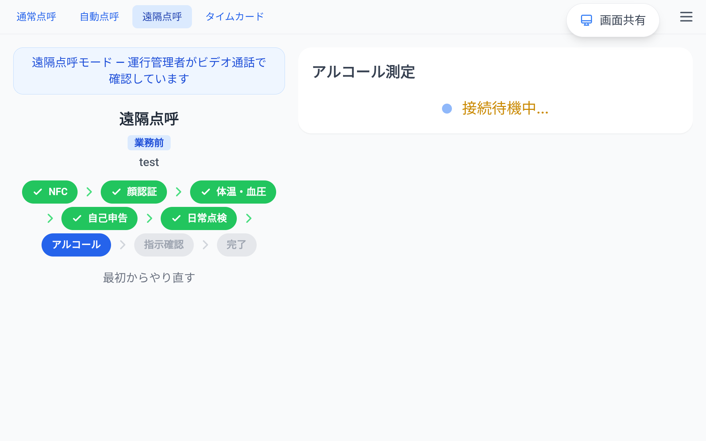

FC-1200 の接続を待ち、息を吹きかけて測定します。

**指示事項確認**

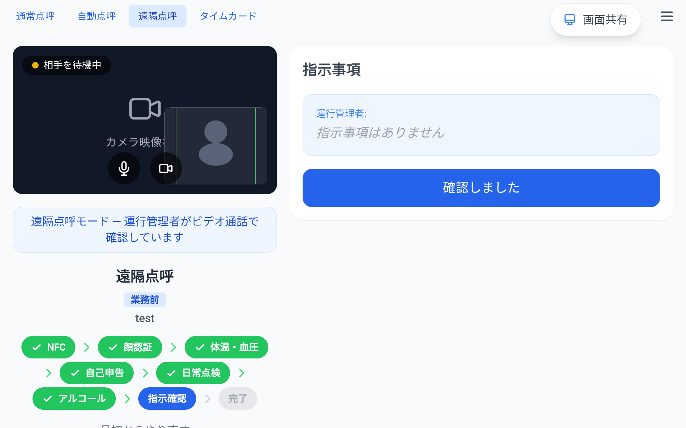

運行管理者からの指示事項を確認し、「確認しました」をタップします。

**完了**

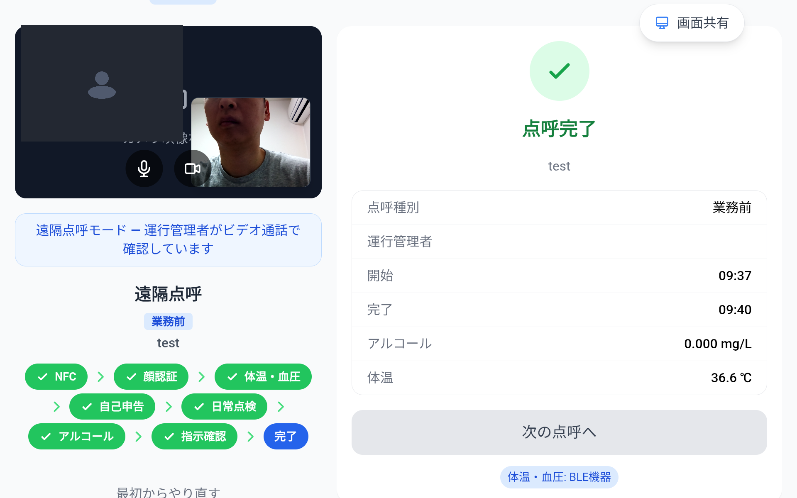

点呼が完了すると、結果サマリーが表示されます。「次の点呼へ」をタップして終了します。

### 通信が切れた場合

ネットワーク接続が切れた場合、自動で再接続を試みます。再接続できない場合は、通常の自動点呼に切り替えて点呼を完了させてください。

### よくある質問

**Q: ビデオ通話の映像が映らない場合は？**
A: カメラの権限が許可されているか確認してください。アプリの設定からカメラ権限を有効にしてください。

**Q: 音声が聞こえない場合は？**
A: 端末の音量を確認してください。また、マイクの権限が許可されているか確認してください。

---

## タイムカード打刻

### 概要

NFC カードを使って出退勤の打刻を行います。

!!! info "開発中"
    タイムカードタブの画面は現在開発中です。

### NFC カードで打刻

1. 「タイムカード」タブをタップします
2. NFC カードをタッチします
3. カードに紐づけられた乗務員名が表示され、打刻が記録されます
4. 当日の打刻一覧が5秒間表示されます

### 打刻結果の確認

打刻が成功すると、乗務員名と打刻時刻が表示されます。当日の打刻履歴も合わせて確認できます。

### カードが読み取れない場合

- NFC カードを端末の NFC 読み取り位置にしっかりタッチしてください
- 端末の NFC 機能が有効になっているか確認してください
- カードが破損している場合は管理者に連絡してください

---

## 中間点呼

### 概要

中間点呼は、運行中に電話番号と GPS 位置情報を使って点呼を実施する機能です。

### 電話番号の登録

1. 管理者が提供する QR コードをスキャンして登録ページにアクセスします
2. 電話番号マスタから該当する電話番号を選択します
3. 運転者名と社員コードを入力します
4. 「登録」をタップして登録を完了します

### 点呼の実施

1. 登録済みの電話番号から点呼を実施します
2. GPS 位置情報が自動で取得・送信されます

点呼実施時に端末の GPS 位置情報が自動で記録されます。位置情報の権限を許可してください。

### 登録情報の変更

電話番号や運転者名を変更する場合は、再度 QR コードをスキャンして登録し直してください（同じ電話番号で上書き登録されます）。

---

## デバイス登録

### 概要

Google アカウントを使わずに端末を登録する方法です。管理者が発行した QR コードまたは URL を使って登録します。

### QRコードで登録

1. 管理者が表示する QR コードをカメラでスキャンします
2. 端末のデバイス名と電話番号を入力します
3. 登録が完了すると、自動的にアプリが有効化されます

### URLリンクで登録

1. 管理者から共有された URL（LINE 等）をタップします
2. デバイス登録ページが開きます
3. デバイス名と電話番号を入力し、「登録」をタップします
4. 登録が完了すると、自動的にアプリが有効化されます

### 登録コードで登録

1. 管理者から伝えられた登録コードを入力します
2. デバイス名と電話番号を入力します
3. 管理者の承認を待ちます（QR 永久フローの場合）

### 登録後の確認

登録が完了すると、端末にテナント ID とデバイス ID が保存され、以降は自動的にログインされます。
